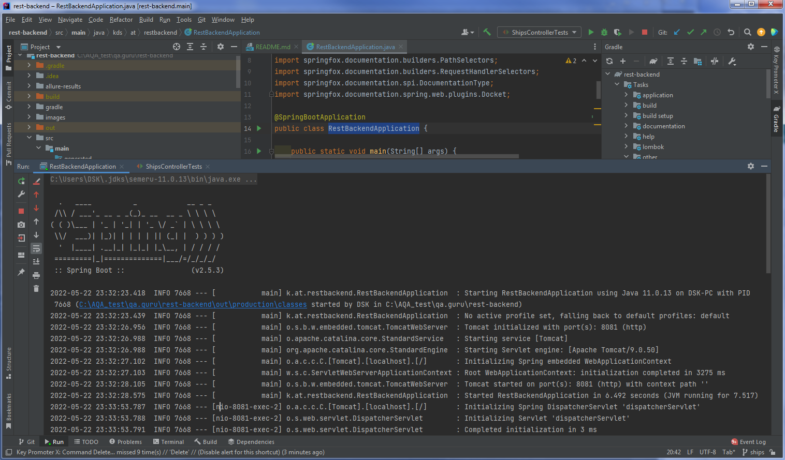
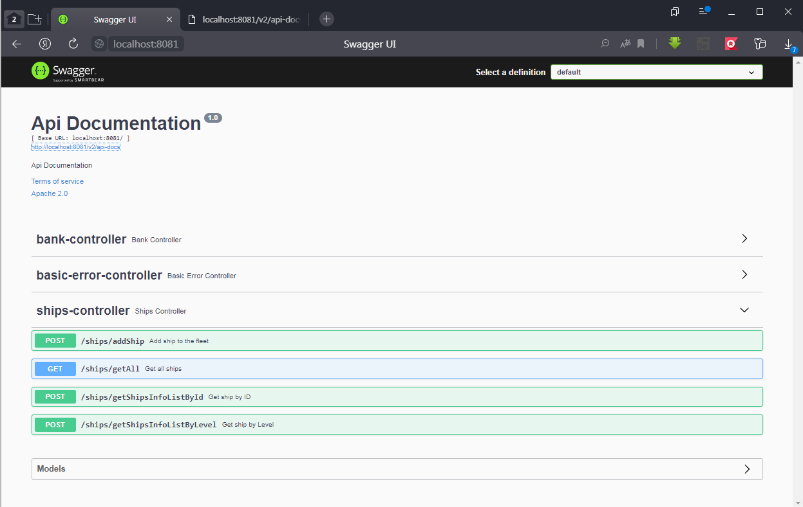
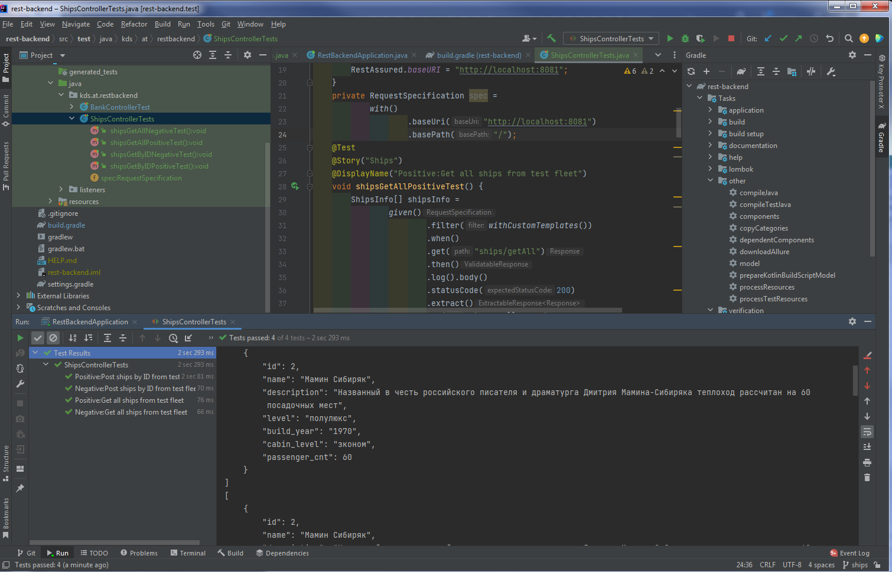

# Automation Tests (Spring Boot based simple Rest application with Swagger and Rest-Assured tests)

## Technology Stack
| <a href="https://www.jetbrains.com/idea/"></a> | <a href="https://www.jetbrains.com/idea/"></a> | <a href="https://www.jetbrains.com/idea/"></a> |  |  |  |  |
|:---------------------------------------------------------------------------------------------------------------------------------------------------------:| :---------: |:---------------------------------------------------------------------------------------------------------------------:|:------------------------------------------------------------------------:|:----------------------------------------------------------------------------------------------------------------------------:|:--------------------------------------------------------------------------:|:------------------------------------------------------------------------------------:|
|                                                                           IDEA                                                                            | Java |                                                          Git                                                          |                                  JUnite                                  |                                                         Spring Boot                                                          |                                  Swagger                                   |                                     Rest-Assured                                     |

## 1) App start (run main):

```bash
src/main/java/kds/at/restbackend/RestBackendApplication.java
```

## 2) Swagger:
### http://localhost:8081/swagger-ui/


## 3) Tests run:
```bash
src/test/java/kds/at/restbackend/ShipsControllerTests.java

```


## Common links&notes:
```bash
Spting boot:
src/main/resources/application.properties
server.port=8081

Swagger:
https://www.baeldung.com/swagger-2-documentation-for-spring-rest-api
3.1. Spring Boot Dependency
4.1. Java Configuration

```

